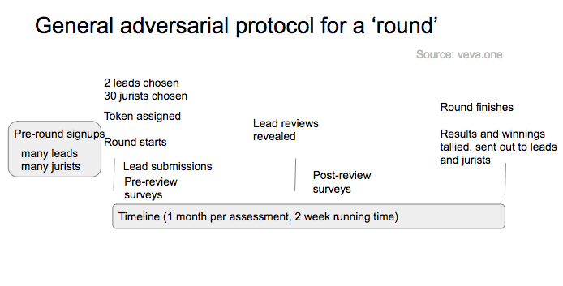

# Longmire Ratestream™


# Longmire Decentralized Token Ratings Agency

## Motivation
Peer-to-peer distributed Blockchain with autonomous contracts offers anyone the ability to issue Tokens for exchange on distributed networks, represented as "Currencies" in the traditional money fiat sense, or as "Securities" in the traditional stock sense

Tokens can be moved by anyone with access to transfer rights.  

Once tokens trade openly on an exchange market (usually following an "Initial Coin Offering"), real money is involved, and many questions arise about Trust and Governance--to date much along the lines of thinking developed over a century of securities practices and legal action. 

Traditional government authorities today are showing strong inclination to intervene in Token Markets, the putative desire being to protect people from fraud and false promises, or to otherwise provide an acceptable legal framework for token trading.

What isn't clear is whether centralized authorities are the best way to cope with free speech activity on decentralized networks, in either legalistic ways or even whether pragmatic intervention is even a reasonable possibility.

## Governance on the Blockchain
Decentralized networks no doubt will do better if Governance is built into them from the ground up with a variety of built-in safeguards, avoiding need for intervention from external authorities

### Adversarial Network and Game
Longmire Rating Agency is one attempt at Governance, a model that relies on networks of trusted participants to analyze tokens, a game between participating analysts to challenge and judge authenticity and assess value.  

Longmire is a set of blockchain + app technologies for bringing conflict-free community ratings to blockchain tokens/investments

In ratings, a lot of money is at stake, leading to considerable difficulty of being both reliably conflict free--i.e. without artificial bias and pumping up of ratings results--and of broad enough perspective to have predictive power

Longmire uses strong kyc together with an adversarial process coupled with game play where honest behavior is rewarded 

Originally Veva and then derived and evolved from that protocol, Longmire begins with Ratestream, an innovative use of telegram bots to generate an ongoing stream of fresh data, highly responsive to new knowledge revealed and market movements. The use of the Bot as interface allows for easy onboarding to attract and train new analysts

In addition, the rapid game play and flow lead to participants becoming knowledgable about important cybertokens, and well-versed in the approaches to analyzing token sentiment along several different dimensions

We also provide an api and a widget for placement of sentiment data on external websites and journals. 

## Website
[Longmire-IO](https://longmire.io)


### Longmire Rules / Flow
> A series of assessment Rounds is run for every Token under consideration, each typically is of a Month time frame.  

> A round begins by giving it a number of LMR Tokens, these tokens are to be 'won' by the participants when the Round is tallied

> Analysts express their availability for each particular round, going into a pool of analysts to be randomly chosen whenever tokens are scheduled

> To schedule a token for assessment, a jury and lead bull and bear analysts are chosen from the pool of available analysts.  

> Each member of the jury completes the Token survey to enter the Round.  

> Leads then submit their briefs on the Token.

> Following submission of Lead briefs, Jury Members re-take the survey

> Once the Round ends at the end of the round period LMR Tokens are issued, the Assessments are tallied, the Effectiveness (Sway) of each of the Leads is assessed; Jury members are given points according to a Keynesian Beauty Contest formula.  

> LMR Tokens are issued based on relative performance and the Round is finished.


### longmire protocol



### sequencer


### ratestream 'rounds'


### 'round' detail


### components


## Content

Tools
- Truffle
- Geth private server
- ReactJS 16+
- Redux
- react-hot-reload 3.1+
- React router 4
- react-router-redux 5.x
- webpack 3
- postcss
- sass
- jest
- enzyme
- telegram messenger


## Documentation

#### Bot Commands:

Regular User commands
* /start, /restart: Starts the bot or refreshes main buttons
* /review: review a new token, or continue reviewing an assigned token
* /rate: rate a new token, or continue rating an assigned token
* /activity: show user status, rounds active and historical, tokens won
* /news: show news relevant to current and recent game states and portfolio
* /token num
* /tokens <range-start from top>
* /portfolio: show user portfolios
* /settings: adjust user settings
  
Admin Privileged commands
* /refreshInfo: Force refresh of Info sources
* /refreshTopTokens: Force refresh of live token data
* /tally: assess rounds statuses
* /ratings: compile ratings snapshot for tokens
* /clearRounds: clear all rounds
* /time: show current game time
* /cron: advance current game time


## Usage

### Prerequisite

> Ensure to have NodeJS v6.x MINIMUM.

### Install
```bash
npm install
```


### bundle dev mode

```bash
npm run dev
```

### dev : hot reload mode

Development mode = best dev experience (*hot reload, redux devtools extension...*).

```bash
npm run start
```

> Then go to [localhost:3001](http://localhost:3001)

### bundle production mode

```bash
npm run prod
```

### run production

In `Development` ReactJS is `not optimized at all` (*you may even find the application to be slow*).

*ReactJS shows its real power and is `amazing fast` when bundled in `production`.*

*General case:*
```bash
npm run prod-server
```
> Then go to localhost:8081

### build and deploy contracts with Truffle
> rm -rf build
> truffle compile
> truffle migrate


